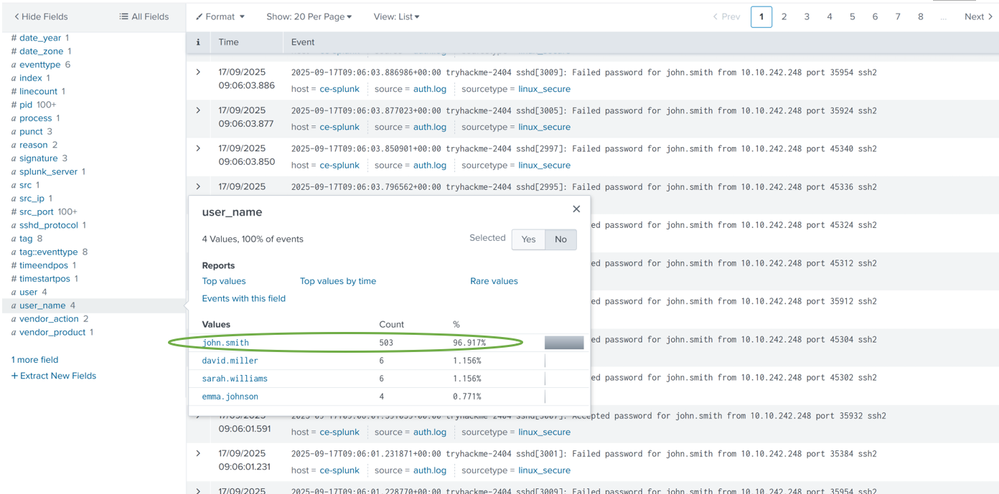
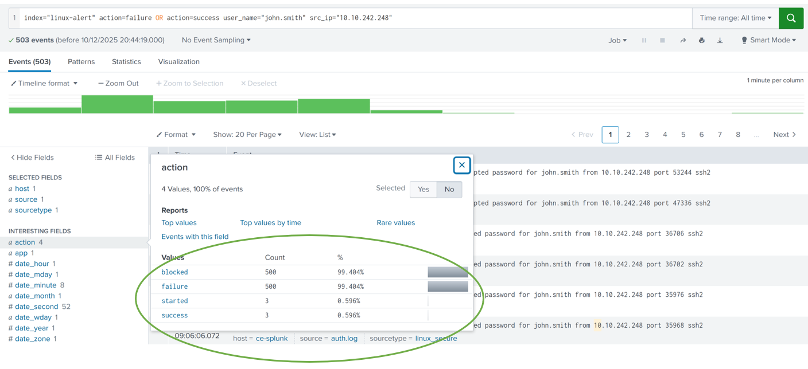
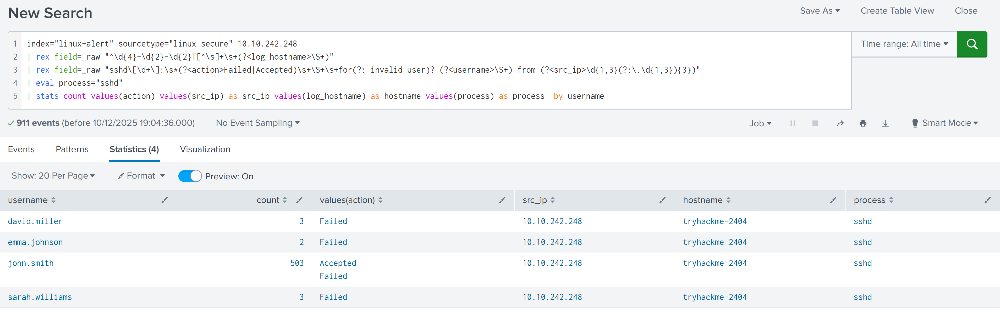
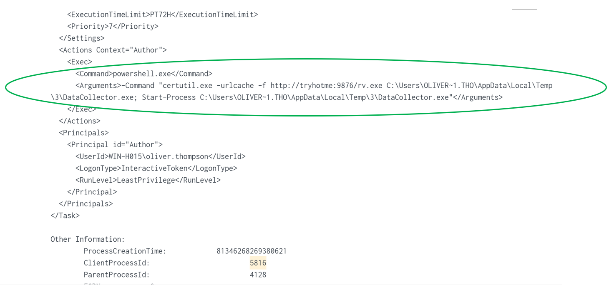
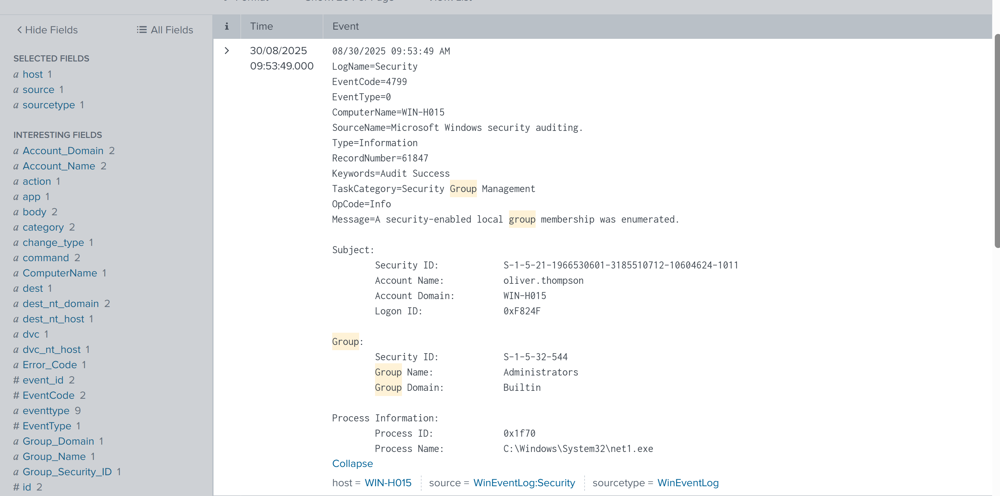
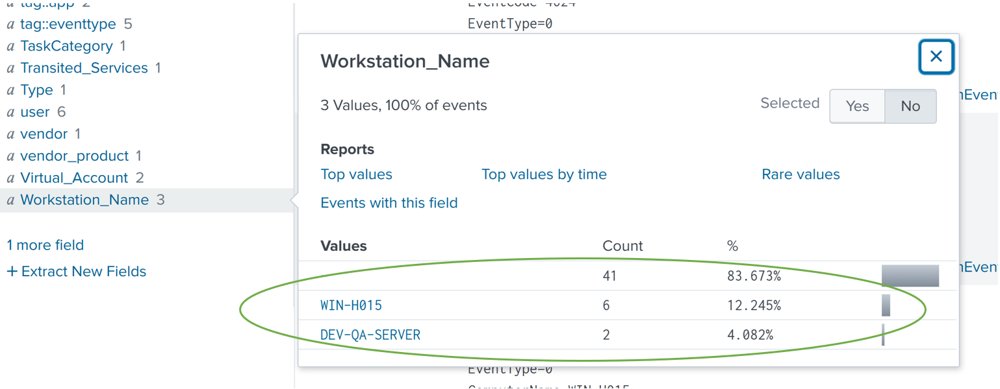
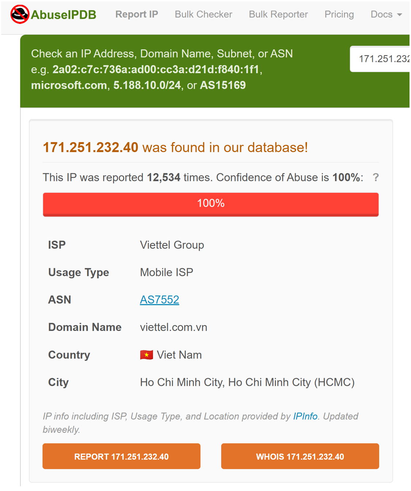
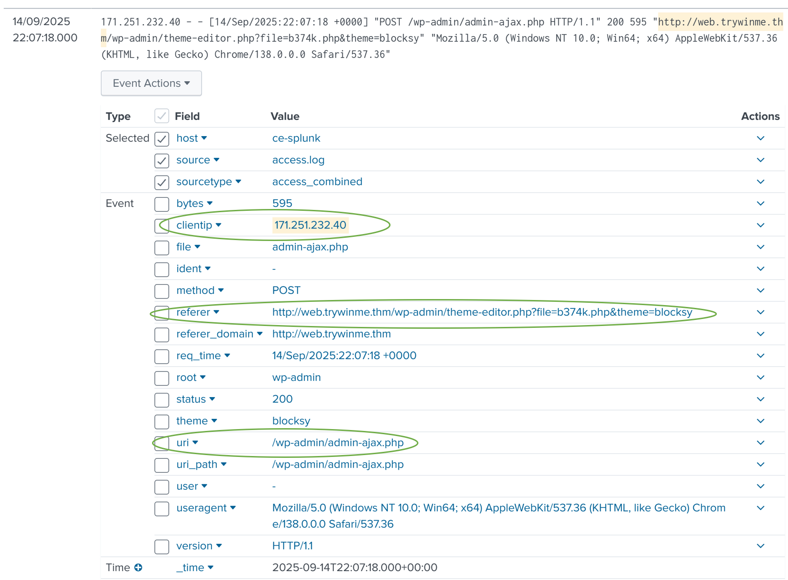

# Using Splunk to Triage Alerts and Investigate Malicious Activity

**See the project summary:** [README.md](README.md)

## Executive Summary
This portfolio documents my hands-on investigation of three distinct cyber-attack scenarios in a simulated Security Operations Centre (SOC) environment. Using Splunk as my primary tool, I successfully triaged and analysed alerts for a Linux brute-force attack, a Windows malicious scheduled task, and a web shell upload on a compromised server.

For each incident, I followed a methodical process to identify key indicators of compromise (IoCs), scope the impact, and map the attacker's actions to the MITRE ATT&CK framework. This work demonstrates my practical ability to perform essential Level 1 SOC analyst functions, from initial alert assessment to detailed forensic investigation and threat reporting.

---

## Alert Scenario #1: Linux Brute-Force Attack

**Alert Details:**
*   **Alert Name:** Brute Force Activity Detection
*   **Time:** 17/09/2025 9:00:21 AM
*   **Target Host:** `tryhackme-2404`
*   **Source IP:** `10.10.242.248`

**Objective:** Investigate this activity and decide whether it should be considered suspicious.

**Tools & Technologies Used:** Splunk

### Methodology & Findings
1.  **Initial Filtering:** I first filtered the authentication logs (`auth.log`) for all `Failed` and `Accepted` password events from the source IP `10.10.242.248`.
    ```splunk
    index="linux-alert" src_ip="10.10.242.248" action=failure OR action=success
    ```
    This revealed a disproportionate volume of events for user `john.smith` compared to other users.



2.  **Focused User Analysis:** I drilled down into the success and failure rates for `john.smith` from the suspicious IP.
    ```splunk
    index="linux-alert" action=failure OR action=success user_name="john.smith" src_ip="10.10.242.248"
    ```
    **Finding:** `500 failed login` events occurred within a 5-minute window, followed by `3 successful "Accepted password"` events from the same IP. This is a clear indicator of a successful brute-force attack.



4.  **Data Visualisation:** I utilised a pre-written query to visualise the attack pattern, confirming the targeted nature of the activity.



5.  **Post-Compromise Activity:** Investigating activity post-successful login revealed further attacker actions:
    *   **Privilege Escalation:** The attacker abused `sudo` to escalate `john.smith`'s privileges to `root`.
        ```splunk
        index="linux-alert" john.smith app=sudo
        ```
    *   **Persistence:** A new user account named `system-utm` was created, a common technique for maintaining access.
        ```splunk
        index="linux-alert" adduser
        ```

### MITRE ATT&CK Summary for Alert #1
*   **TA0001: Initial Access**
    *   **T1110 - Brute Force:** Credential attack against user `john.smith`.
*   **TA0004: Privilege Escalation**
    *   **T1548 - Abuse Elevation Control Mechanism:** Abused `sudo` to gain `root` privileges.
*   **TA0003: Persistence**
    *   **T1136 - Create Account:** Created the `system-utm` user for persistent backdoor access.

**Conclusion:** A successful brute-force attack led to full system compromise (root access) and the creation of a persistent backdoor account.

---

## Alert Scenario #2: Windows Malicious Scheduled Task

**Alert Details:**
*   **Alert Name:** Potential Task Scheduler Persistence Identified
*   **Time:** 30/08/2025 10:06:07 AM
*   **Host:** `WIN-H015`
*   **User:** `oliver.thompson`
*   **Task Name:** `AssessmentTaskOne`

**Objective:** Investigate this activity and decide whether it should be considered suspicious.

**Tools & Technologies Used:** Splunk

### Methodology & Findings
1.  **Alert Validation:** I filtered logs using the unique task name and Windows Event ID 4698 (Scheduled Task Creation).
    ```splunk
    index="win-alert" "AssessmentTaskOne" EventCode=4698
    ```
    A single, clearly malicious log was returned. The task was configured to execute daily, running a PowerShell command that used `certutil.exe` to download (`rv.exe`) and execute (`DataCollector.exe`) a payload from `http://tryhotme:9876`.



3.  **Process Ancestry:** Using the parent process ID from the log, I traced the task creation to `C:\Windows\system32\cmd.exe` run by user `WIN-H015\oliver.thompson`.

4.  **Attacker Reconnaissance:** I discovered the attacker enumerated the local "Administrators" group, likely to map privileged accounts for lateral movement.
    ```splunk
    index="win-alert" "Group" Account_Name="oliver.thompson"
    ```



5.  **Source Identification:** By checking successful logon events (Event ID 4624) on the target host, I identified the initial access point.
    ```splunk
    index="win-alert" host="WIN-H015" EventCode=4624
    ```
    **Finding:** The attacker initially accessed `WIN-H015` from the workstation `DEV-QA-SERVER`.



### MITRE ATT&CK Summary for Alert #2
*   **TA0003: Persistence**
    *   **T1053.005 - Scheduled Task:** Created malicious task `AssessmentTaskOne`.
*   **TA0002: Execution & TA0005: Defense Evasion**
    *   **T1059.003 - Command and Scripting Interpreter:** Used `cmd.exe` and `certutil.exe` to download and execute a payload (**T1105 - Ingress Tool Transfer**).
*   **TA0007: Discovery**
    *   **T1069.002 - Permission Groups Discovery:** Enumerated the local "Administrators" group.
*   **TA0008: Lateral Movement**
    *   **T1570 - Lateral Tool Transfer:** Initial access originated from a compromised workstation (`DEV-QA-SERVER`).

**Conclusion:** An attacker created a persistent, malicious scheduled task to download and execute a payload, following initial access and reconnaissance of local admin groups.

---

## Alert Scenario #3: Web Shell Upload & Brute-Force

**Alert Details:**
*   **Alert Name:** Potential Web Shell Upload Detected
*   **Time:** 14/09/2025 09:31:51 AM
*   **Resource:** `http://web.trywinme.thm`
*   **Suspicious IP:** `171.251.232.40`

**Objective:** Investigate this activity and decide whether it should be considered suspicious.

**Tools & Technologies Used:** Splunk, AbuseIPDB, VirusTotal

### Methodology & Findings
1.  **Threat Intelligence Enrichment:** I first queried external platforms (AbuseIPDB, VirusTotal) for the suspicious IP (`171.251.232.40`). It was confirmed malicious with over 12,500 community reports, instantly raising the alert's priority.Utilising- AbuseIPD.png



2.  **Web Log Analysis:** Filtering web server (`access.log`) traffic from the malicious IP revealed active interaction with a known PHP web shell (`b374k.php`).
    ```splunk
    index=web-alert clientip="171.251.232.40" http://web.trywinme.thm
    ```
    The attacker accessed the shell via the WordPress theme editor (`/wp-admin/theme-editor.php?file=b374k.php`) and issued commands through `/wp-admin/admin-ajax.php`.



3.  **Hydra Brute Force Activity:** A broader query visualised all activity from the malicious IP, sorting by time.
    ```splunk
    index=web-alert 171.251.232.40
    | table _time clientip useragent uri_path method status
    | sort + _time
    ```
    **Finding:** The attack began earlier with a brute-force attempt against `/wp-login.php` using the tool `Hydra` (visible in the User-Agent string), which started at `2025-09-14 21:20:27`.

4.  **Web Shell Activity Isolation:** A final query specifically detailed the web shell execution, showing the initial access GET request and subsequent command execution POST requests.

### MITRE ATT&CK Summary for Alert #3
*   **TA0003: Persistence**
    *   **T1505.003 - Server Software Component:** Uploaded the `b374k.php` web shell.
*   **TA0002: Execution**
    *   **T1059 - Command and Scripting Interpreter:** Executed commands via the PHP web shell.
*   **TA0006: Credential Access**
    *   **T1110 - Brute Force:** Attempted to brute-force WordPress credentials using Hydra.

**Conclusion:** An attacker successfully uploaded a web shell to a web server, establishing persistent remote access after an attempted brute-force attack on administrative credentials.

---

## Overall Takeaways
Investigating these three scenarios provided critical insights into real-world attack sequences and defensive analysis:

*   **Attackers Follow a Predictable "Kill Chain":** Each scenario illustrated clear progression (e.g., brute-force → privilege escalation → persistence). Recognizing these patterns allows an analyst to anticipate and hunt for related activity.
*   **Effective Triage Requires Correlation:** A comprehensive investigation depends on synthesizing information from different log types (auth, Windows Event, web server) and connecting events across hosts.
*   **Threat Intelligence is a Force Multiplier:** Consulting external sources (AbuseIPDB, VirusTotal) to confirm the reputation of an IOC transforms a suspicious event into a high-confidence alert, enabling a faster, more decisive response.
*   **MITRE ATT&CK is the Essential Language:** Mapping evidence to specific techniques is crucial for clearly communicating the nature of the threat to both technical teams and management, ensuring a unified understanding of risk and response priorities.
